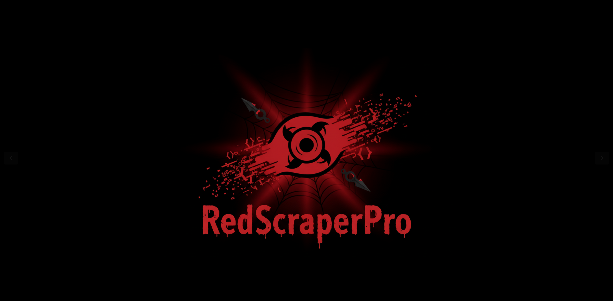
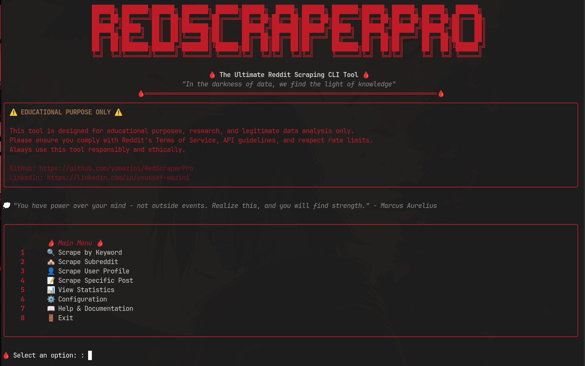

# 🔴 RedScraperPro

```
██████╗ ███████╗██████╗ ███████╗ ██████╗██████╗  █████╗ ██████╗ ███████╗██████╗ ██████╗ ██████╗  ██████╗ 
██╔══██╗██╔════╝██╔══██╗██╔════╝██╔════╝██╔══██╗██╔══██╗██╔══██╗██╔════╝██╔══██╗██╔══██╗██╔══██╗██╔═══██╗
██████╔╝█████╗  ██║  ██║███████╗██║     ██████╔╝███████║██████╔╝█████╗  ██████╔╝██████╔╝██████╔╝██║   ██║
██╔══██╗██╔══╝  ██║  ██║╚════██║██║     ██╔══██╗██╔══██║██╔═══╝ ██╔══╝  ██╔══██╗██╔═══╝ ██╔══██╗██║   ██║
██║  ██║███████╗██████╔╝███████║╚██████╗██║  ██║██║  ██║██║     ███████╗██║  ██║██║     ██║  ██║╚██████╔╝
╚═╝  ╚═╝╚══════╝╚═════╝ ╚══════╝ ╚═════╝╚═╝  ╚═╝╚═╝  ╚═╝╚═╝     ╚══════╝╚═╝  ╚═╝╚═╝     ╚═╝  ╚═╝ ╚═════╝ 
                                                                                                           
    🩸 The Ultimate Reddit Scraping CLI Tool 🩸
    "In the darkness of data, we find the light of knowledge"
```

> **⚠️ EDUCATIONAL PURPOSE ONLY**  
> This tool is designed for educational purposes, research, and legitimate data analysis only. The author is not responsible for any misuse. Please ensure you comply with Reddit's Terms of Service, API guidelines, and respect rate limits. Always use this tool responsibly and ethically.

---



## 🎯 Features

### Core Scraping Capabilities
- ✅ **Posts & Comments Scraping** - Extract both posts and their comments
- ✅ **Multiple Scraping Modes**:
  - 🔍 Keyword-based scraping
  - 🏘️ Subreddit scraping
  - 👤 User profile scraping
  - 📝 Individual post scraping
- ✅ **Real-time Scraping** - Live data extraction as it happens
- ✅ **Resume Interrupted Scraping** - Continue where you left off
- ✅ **Configurable Depth Limits** - Control how deep to scrape
- ✅ **Native Command-Line Access** - Run the tool from anywhere on your system with simple aliases like `rsp` or `redscraperpro`.
- ✅ **Robust & Standardized Installation** - Uses modern Python packaging to create reliable, cross-platform launchers for Windows, macOS, and Linux.

### Export & Data Management
- 📊 **Multiple Export Formats**: CSV, XLSX, JSON, TXT
- 🧹 **Duplicate Detection & Removal** - Clean your data automatically
- 📈 **Optional Sentiment Analysis** - Lightweight sentiment scoring
- 📋 **Comprehensive Data Fields** - Title, author, score, timestamp, awards, and more

### User Experience
- 🎨 **Beautiful ASCII Art** - Horror/Itachi Uchiha themed interface
- 📊 **Real-time Progress Tracking** - See your scraping progress live
- 🔧 **Configuration Wizard** - Easy first-time setup
- 📱 **Cross-platform** - Works on Windows, macOS, and Linux
- 🆘 **Comprehensive Help System** - Built-in documentation and examples
- 💭 **Inspirational Quotes** - Stoic, Kafka, Dostoevsky, and Itachi-themed quotes

---

## 🚀 The RedOcean Ecosystem

RedScraperPro is a core component of the **RedOcean Ecosystem**, a suite of tools designed to provide an end-to-end workflow for market intelligence, from data collection to strategic action. All-In-One

<div align="center">

| Tool | Purpose | Status |
| :--- | :--- | :--- |
| 🔴 **[RedScraperPro](https://github.com/yomazini/RedScraperPro)** | **Data Collection** | ✅ Live |
| 🔵 **[RedOceanRadar](https://github.com/yomazini/RedOceanRadar)** | **Strategic Analysis** | 🧪 Beta (Not Stable) |
| ⚫ **[RedNexusPro](https://github.com/yomazini/RedNexusPro)** | **Contact & Lead Generation** | 🏗️ In Development |

</div>

----

## 🚀 Quick Start

### Prerequisites
- Python 3.8 or higher
- Reddit API credentials (PRAW)

### Installation
A simple installation script is provided to set up the tool and its dependencies.

```bash
# Clone the repository
git clone https://github.com/yomazini/RedScraperPro.git
cd RedScraperPro

# Run the installation script
chmod +x install.sh && ./install.sh

source venv/bin/activate  
```
After installation, you can run the tool using `redscraperpro`, `rsp`, or `python3 src/redscraperpro/main.py`.



---

### Getting Reddit API Credentials
📖 **Detailed Guide**: [How to Get PRAW API Credentials](./RedScraperPro/DOCUMENTATION.md)

Quick steps:
1. Go to [Reddit Apps](https://www.reddit.com/prefs/apps)
2. Click "Create App" or "Create Another App"
3. Choose "script" as the app type
4. Note down your `client_id`, `client_secret`, and set your `user_agent`. You can find your user agent here: [What is my User Agent?](https://51degrees.com/developers/user-agent-tester)

---

## 🎮 Usage

### Interactive Mode
```bash
# Run using any of the aliases
rsp
# or
redscraperpro
```

### Command Line Mode
```bash
# Scrape by keyword
rsp --mode keyword --query "python programming" --limit 100

# Scrape subreddit
redscraperpro --mode subreddit --target "programming" --limit 50

# Scrape user posts
rsp --mode user --target "username" --limit 25

# Export to different formats
rsp --mode keyword --query "AI" --export xlsx --output "ai_posts"
```

### Configuration
The first time you run the tool, a configuration wizard will launch to help you set up:
- Reddit API credentials
- Default export settings
- Scraping preferences
- Output directories

---

## 📁 Project Structure

```
.
├── RedScraperPro/
│   ├── assets/
│   │   ├── ascii_art.txt
│   │   └── quotes.json
│   ├── config/
│   │   └── readme.md
│   ├── docs/
│   │   ├── installation.md
│   │   ├── praw-setup.md
│   │   ├── sentiment_analysis.md
│   │   ├── troubleshooting.md
│   │   └── usage-examples.md
│   ├── examples/
│   │   └── basic_scraping.py
│   ├── exports/
│   │   └── README.md
│   ├── logs/
│   │   └── README.md
│   ├── src/
│   │   └── redscraperpro/
│   │       ├── cli/
│   │       │   ├── __init__.py
│   │       │   ├── interface.py
│   │       │   └── wizard.py
│   │       ├── exporters/
│   │       │   ├── __init__.py
│   │       │   ├── csv_exporter.py
│   │       │   ├── json_exporter.py
│   │       │   ├── txt_exporter.py
│   │       │   └── xlsx_exporter.py
│   │       ├── scraper/
│   │       │   ├── __init__.py
│   │       │   ├── comment_scraper.py
│   │       │   ├── post_scraper.py
│   │       │   ├── reddit_scraper.py
│   │       │   └── user_scraper.py
│   │       ├── utils/
│   │       │   ├── __init__.py
│   │       │   ├── ascii_art.py
│   │       │   ├── config.py
│   │       │   ├── logger.py
│   │       │   ├── progress.py
│   │       │   ├── quotes.py
│   │       │   └── sentiment.py
│   │       ├── __init__.py
│   │       └── main.py
│   ├── tests/
│   ├── DOCUMENTATION.md
│   ├── FINAL_SUMMARY.md
│   ├── LICENSE
│   ├── NOTICE
│   ├── PROJECT_SUMMARY.md
│   ├── install.sh
│   ├── notes_after_somefixed.md
│   ├── requirements.txt
│   └── setup.py
├── README.md
└── logo.png
```

---

## 💡 Best Usage / Monetization "MUST READ"
This is a detailed article on the best usage and monetization strategies for this tool RedScraperPro:
- [From Research to Revenue - Complete Usage Guide & Real-World Success Stories With RedScraperPro](https://medium.com/@mazini/redscraperpro-best-usuage-and-best-practice-e2e67f2c2971)

---

## 🎨 Themes & Aesthetics

RedScraperPro features a unique **Horror/Itachi Uchiha** aesthetic with:
- 🔴 Red color scheme throughout the interface
- 🩸 Dark, mysterious ASCII art
- 💭 Philosophical quotes from Stoic philosophers, Kafka, Dostoevsky
- ⚡ Itachi Uchiha-inspired themes and quotes
- 🌙 Dark terminal-friendly design

---

## 📊 Data Fields Extracted

### Posts
- Title, Author, Score (upvotes/downvotes)
- Creation timestamp, URL, Flair
- Number of comments, Awards
- Subreddit, Post ID, Permalink
- Content/Selftext, Media URLs
- Optional: Sentiment score

### Comments
- Comment body, Author, Score
- Creation timestamp, Comment ID
- Parent comment ID, Depth level
- Awards, Controversiality
- Optional: Sentiment score

---

## 🔧 Configuration Options

- **API Credentials**: Reddit API setup
- **Export Settings**: Default formats and locations
- **Scraping Limits**: Posts/comments per session
- **Sentiment Analysis**: Enable/disable sentiment scoring
- **Logging Level**: Control verbosity
- **Theme Settings**: ASCII art and color preferences
- **Resume Settings**: Auto-save progress for resuming

---

## 🚨 Rate Limiting & Best Practices

- **Respect Reddit's API limits** - Tool provides warnings but doesn't enforce limits
- **Use reasonable delays** between requests
- **Monitor your API usage** through Reddit's developer dashboard
- **Be respectful** of communities and users
- **Follow Reddit's ToS** and community guidelines

---

## 📄 License

This project is licensed under the MIT License - see the [LICENSE](RedScraperPro/LICENSE) file for details.

---

## 🙏 Acknowledgments

- **Reddit API (PRAW)** - For providing excellent API access
- **Stoic Philosophers** - For timeless wisdom
- **Franz Kafka** - For existential insights
- **Fyodor Dostoevsky** - For psychological depth
- **Itachi Uchiha** - For the aesthetic inspiration

---


### 🩸"Those who cannot acknowledge themselves will eventually fail." - Itachi Uchiha🩸
RedScraperPro acknowledges itself as the ultimate Reddit scraping tool, and therefore, it will never fail. How?, With Your Support 🌟.

---

## 📞 Support & Contact

- 🐛 **Issues**: [GitHub Issues](https://github.com/yomazini/RedScraperPro/issues)
- 📺 [YouTube Workflow Explained](https://youtu.be/ESsoLqJwYR4)
- 📖 **Documentation**: [Full Guide](https://github.com/yomazini/RedScraperPro/blob/master/RedScraperPro/DOCUMENTATION.md)
- 튜 **YouTube Beginner Tutorial**: [Watch the tutorial](https://youtu.be/QAWp9YYULhk)
- 💼 **LinkedIn**: [Connect with the developer](https://www.linkedin.com/in/youssef-mazini/)
- 🐙 **GitHub**: [@yomazini](https://github.com/yomazini)
- 📞 **X(Twitter)**: [@mazini_youssef](https://x.com/mazini_youssef)


---

### *"In the world of data, we are all just shadows seeking light." - RedScraperPro Philosophy*
